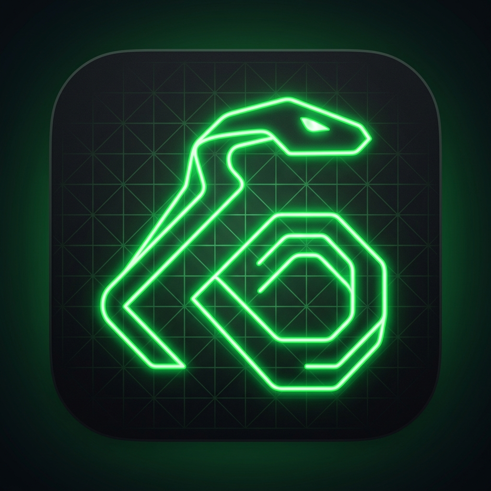

# Snake: The Ultimate Arcade 🐍

A premium, polished, startup-quality **Snake** game built from scratch for iOS using Swift & SwiftUI. Inspired by modern arcade interfaces, it features clean geometry, smooth animations, glowing custom themes, haptics, synthesised retro sound effects, a high-performance Canvas game board, and multiple game modes.



---

## Features ✨
- **Classic Grid Movement:** Precise and responsive swipe-based controls.
- **Directional Pad Option:** Toggleable tactile on-screen controls for classic D-pad gameplay.
- **Dynamic Synthesizer Sound:** Fully offline, dynamically generated 8-bit retro sound effects using `AVAudioEngine` (no heavy asset binaries required!).
- **Tactile Haptic Feedback:** Physical pulses for eating food, hitting milestones, triggering combos, and crashing.
- **Combo Multiplier System:** Eat food in quick succession (under 3.0s) to build up to a `5x` combo, increasing score gains dramatically.
- **Special Golden Food:** Rare spawn golden apples that flash and vanish after 8 seconds, providing massive bonus multipliers.
- **Autonomous Play Screen Background:** The launch screen features a smart pathfinding AI playing Snake automatically in the background.
- **Trophies & Logs:** Built-in statistics page tracking total games, total food eaten, longest snake length, and total time played.
- **Achievements:** 9 unique unlockable local badges stored offline.
- **Custom Snake Skins:** Custom skin colors (Green, Cyan, Pink, Orange, Gold, Purple, White) to customize your snake.

---

## Game Modes 🕹️
1. **Classic Mode:** Traditional rules. Avoid the walls and your own tail.
2. **No Walls Mode:** Wrap around screen boundaries seamlessly.
3. **Speed Dash:** Snake speed scales up progressively after eating food.
4. **Obstacles Mode:** Navigating a shifting maze of random obstacles that scale as your score grows.
5. **Zen Mode:** Slower, relaxed speed. Portal boundaries and no intense speed ramps.
6. **Time Attack:** A frantic 60-second timer challenge to get the highest score.

---

## Difficulties ⚡
- **Easy:** Base speed (200ms), 3 starting segments, fewer obstacles.
- **Medium:** Base speed (140ms), 4 starting segments, medium obstacles.
- **Hard:** Base speed (90ms), 5 starting segments, high obstacles.
- **Insane:** Base speed (55ms), 6 starting segments, extreme obstacles.

---

## Board Themes 🎨
Choose between 4 custom visual setups:
- **Classic Green:** Forest and neon greens on standard grey grid.
- **Neon Grid:** Dark cyberpunk background, cyan and neon pink glowing accents.
- **Midnight Purple:** Royal purple borders with gold food and violet accents.
- **Retro Arcade:** Classic monochrome amber and pure black pixel styling.

---

## Tech Stack 🛠️
- **Language:** Swift 6 (Fully Concurrency-safe)
- **UI Framework:** SwiftUI 
- **Graphics Engine:** SwiftUI Canvas (for high FPS and smooth custom rendering)
- **Audio Synthesis:** AVFoundation / AVAudioEngine
- **Persistence:** Custom Codable model wrapper with UserDefaults
- **Project Structure:** Configured via `xcodegen` and modular Swift layouts

---

## Project Structure 📁
```
Snake/
├── project.yml               # XcodeGen project specification
├── Snake.xcodeproj           # Generated Xcode project
└── Snake/
    ├── SnakeApp.swift        # App Entry Point
    ├── ContentView.swift     # Screen Coordinator / Router
    ├── Info.plist            # App Info Configuration
    ├── Assets.xcassets/      # Asset catalog (with App Icon)
    ├── Models/
    │   ├── Position.swift    # Grid position coordinates
    │   ├── Direction.swift   # Movement directions & safety checks
    │   ├── GameMode.swift    # Game Mode configurations
    │   ├── Difficulty.swift  # Difficulty settings (speed/size/obstacles)
    │   ├── Theme.swift       # Color Palette configurations
    │   ├── Achievement.swift # Achievement model list
    │   └── GameStats.swift   # Statistics schema
    ├── ViewModels/
    │   └── GameViewModel.swift # Game engine, AI autoplay, state coordinator
    ├── Services/
    │   ├── StorageService.swift # Local storage manager
    │   ├── HapticsService.swift # Tactile feedback triggers
    │   └── SoundService.swift   # 8-bit dynamic audio synthesizer
    ├── Views/
    │   ├── HomeView.swift        # Launch screen with active AI background
    │   ├── ModeSelectionView.swift # Custom card mode selector
    │   ├── GameView.swift        # Primary game board with overlays
    │   ├── GameBoardView.swift   # High performance Swift Canvas renderer
    │   ├── StatsView.swift       # Statistics & achievements gallery
    │   └── SettingsView.swift    # Theme, skins, and configurations
    └── Components/
        ├── GlassView.swift       # Glassmorphism visual modifier
        ├── ConfettiView.swift    # CAEmitterLayer victory particles
        └── DirectionalPad.swift  # Tactile virtual dpad
```

---

## Running the Project 📲

### Prerequisites
1. macOS with **Xcode 15+** installed.
2. `xcodegen` tool (optional, project comes pre-generated). If you change files, run:
   ```bash
   brew install xcodegen
   xcodegen
   ```

### Running in Xcode
1. Double-click `Snake.xcodeproj` to open it in Xcode.
2. Select your target simulator (e.g. iPhone 15 Pro).
3. Press `CMD + R` to run!
